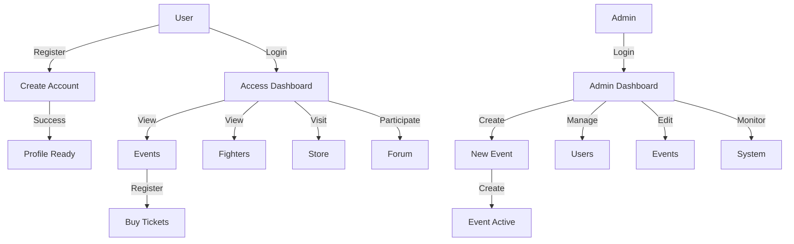
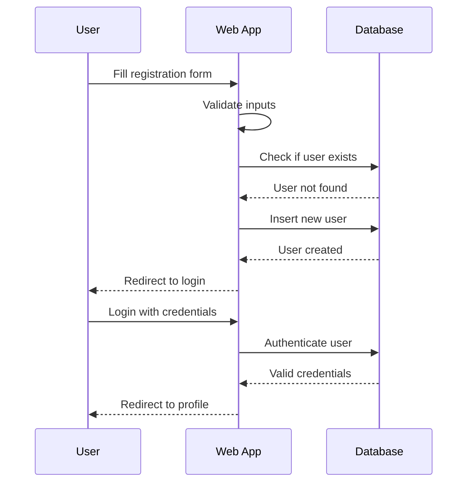
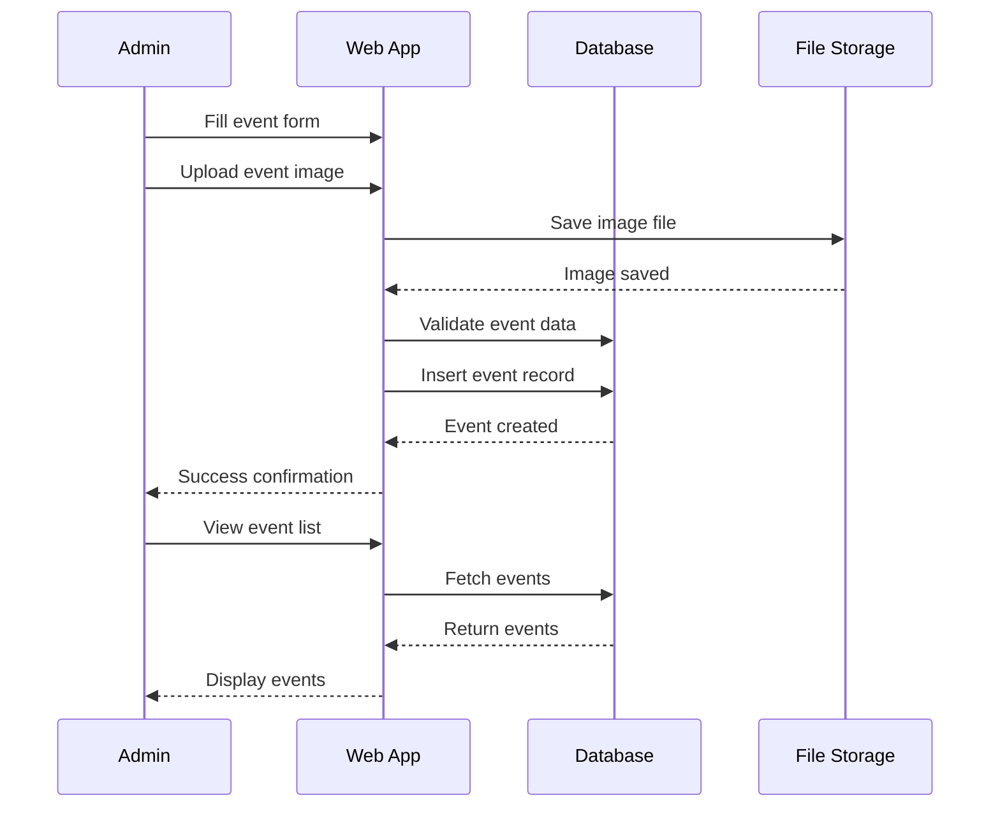
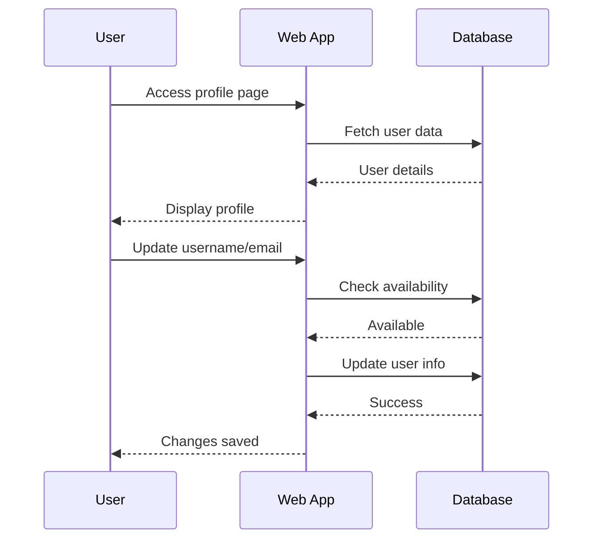
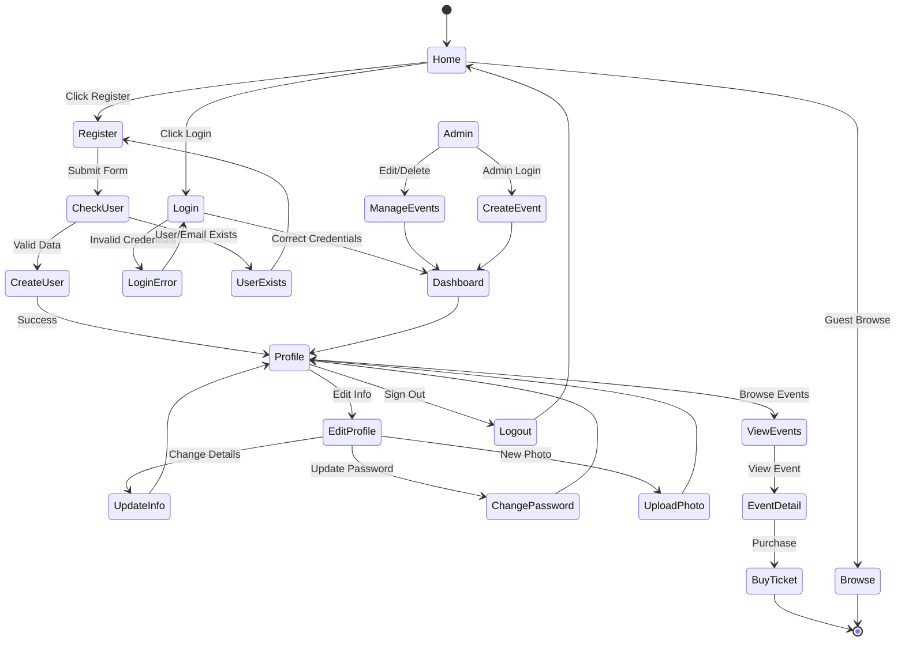

# Knockout Zone - Combat Sports Management Platform

A comprehensive web application for managing combat sports events, fighter profiles, and community engagement.

## Table of Contents

- [Overview](#overview)
- [Main Functionalities](#main-functionalities)
- [Main Use Cases](#main-use-cases)
- [System Architecture](#system-architecture)
- [Application Flow](#application-flow)
- [Database Schema](#database-schema)
- [Installation & Setup](#installation--setup)
- [API Endpoints](#api-endpoints)
- [File Structure](#file-structure)

---

## Overview

Knockout Zone is a platform designed for:
- **Event Management**: Create, update, and manage combat sports events
- **User Management**: Register users, manage profiles, and handle authentication
- **Community Building**: Store, forum, and fighter information showcase
- **Admin Control**: Dedicated admin features for event and user management

---

## Main Functionalities

### 1. **User Management**
- User registration with email validation
- Admin registration with special privileges
- User login/logout with session management
- Profile management (update username, email, password)
- Profile picture upload and management
- Account deletion

### 2. **Event Management**
- Create new events with detailed information
- Upload event images
- Edit event details (title, date, location, description)
- Delete events (owner only)
- View all upcoming events with sorting by date
- Event filtering and search capabilities

### 3. **Content Management**
- Store section with merchandise listings
- Fighters directory with profiles
- Forum for community discussions
- About Us information page
- Home page with featured content

### 4. **Admin Features**
- Admin-only event management
- User management capabilities
- Profile picture management
- Event statistics and tracking

---

## Main Use Cases



### Use Case 1: New User Registration


### Use Case 2: Event Creation & Management


### Use Case 3: User Profile Management


---

## System Architecture

```mermaid
graph TB
    subgraph Client["Client Layer"]
        HTML["HTML Views<br/>index, vlogin, vregister<br/>profile, events, etc"]
        CSS["CSS Styling<br/>Responsive Design"]
        JS["JavaScript<br/>Event Handlers<br/>Form Validation"]
    end
    
    subgraph Server["Server Layer"]
        UC["UserController<br/>- login<br/>- register<br/>- updateUser<br/>- updatePassword"]
        EC["EventController<br/>- create<br/>- delete<br/>- update"]
        Auth["Authentication<br/>Session Management"]
    end
    
    subgraph Database["Database Layer"]
        Users["Users Table<br/>id, name, email<br/>password, path_pfp"]
        Events["Events Table<br/>id, title, event_date<br/>location, created_by"]
    end
    
    subgraph Resources["File Storage"]
        Profiles["Profile Pictures<br/>resources/profiles/"]
        Images["Event Images<br/>resources/images/"]
    end
    
    HTML -->|POST/GET| UC
    HTML -->|POST/GET| EC
    JS -->|Form Data| HTML
    CSS -->|Styles| HTML
    
    UC -->|Query| Users
    UC -->|Session| Auth
    EC -->|Query| Events
    EC -->|Foreign Key| Users
    
    UC -->|Upload| Profiles
    EC -->|Upload| Images
    
    Auth -->|Validate| Users
```



---

## Application Flow



---

## Database Schema

```mermaid
erDiagram
    USERS ||--o{ EVENTS : creates
    
    USERS {
        int id PK
        string name UK
        string email UK
        string password
        string path_pfp NK
        timestamp created_at
        timestamp updated_at
    }
    
    EVENTS {
        int id PK
        string title
        datetime event_date
        string location
        text description NK
        string image_path NK
        int created_by FK
        timestamp created_at
        timestamp updated_at
    }
```

---

## Installation & Setup

### Prerequisites
- XAMPP (Apache, MySQL, PHP)
- PHP 8.0+
- MySQL 10.4+

### Steps

1. **Clone/Extract Project**
   ```bash
   cd C:\xampp\htdocs\MP0487
   ```

2. **Create Database**
   ```bash
   # Open phpMyAdmin
   # Create database: knockoutzone
   # Import knockoutzone.sql and seed.sql
   ```

3. **Configure Database Connection**
   - Database name: `mp0487_knockoutzone`
   - Username: `root`
   - Password: (empty)
   - Host: `localhost`

4. **Directory Permissions**
   ```bash
   # Ensure writable directories
   chmod 755 resources/profiles/
   chmod 755 resources/images/
   chmod 755 images/
   ```

5. **Start Server**
   - Start Apache and MySQL in XAMPP Control Panel
   - Navigate to: `http://localhost/MP0487/MP0487_RA5RA6_KO_Zone/view/index.html`

---

## API Endpoints

### User Controller Routes
```
UserController.php?action=login       → POST   Login user
UserController.php?action=logout      → GET    Logout user
UserController.php?action=register    → POST   Register new user
UserController.php?action=registerAdmin → POST Register admin user
UserController.php?action=updateUser  → POST   Update user info
UserController.php?action=updatePassword → POST Change password
UserController.php?action=uploadImage → POST   Upload profile picture
UserController.php?action=deleteUser  → POST   Delete user account
```

### Event Controller Routes
```
eventController.php?action=create     → POST   Create event
eventController.php?action=update     → POST   Update event
eventController.php?action=delete     → POST   Delete event
```

---

## File Structure

```
MP0487_RA5RA6_KO_Zone/
├── controller/
│   ├── UserController.php      # User management (login, register, profile)
│   ├── eventController.php     # Event management (CRUD operations)
│   └── [deprecated files]      # Old individual controller files
├── view/
│   ├── index.html              # Home page
│   ├── vlogin.php              # Login page
│   ├── vregister.php           # User registration
│   ├── vadmin.php              # Admin registration
│   ├── profile.php             # User profile management
│   ├── events.php              # Events display & management
│   ├── store.html              # Store page
│   ├── fighters.html           # Fighters directory
│   ├── forum.html              # Community forum
│   ├── aboutus.html            # About Us page
│   ├── css/                    # Stylesheets
│   │   ├── index.css
│   │   ├── login.css
│   │   ├── profile.css
│   │   ├── events.css
│   │   └── [other styles]
│   └── js/                     # JavaScript files
│       ├── fighters.js
│       ├── index.js
│       └── store.js
├── model/
│   ├── knockoutzone.sql        # Database schema
│   └── seed.sql                # Sample data
├── resources/
│   ├── images/
│   │   ├── aboutus/
│   │   ├── events/
│   │   └── shop/
│   ├── profiles/               # User profile pictures
│   └── videos/
├── images/                     # Event images
└── README.md                   # This file
```

---

## Key Features Implementation

### Authentication & Security
- ✅ Session-based authentication
- ✅ Password validation
- ✅ Email format validation
- ✅ User existence checking
- ✅ Session destruction on logout

### Data Validation
- ✅ Required field validation
- ✅ Email format validation
- ✅ File type validation (images only)
- ✅ File size limits (2MB max)
- ✅ SQL injection prevention (prepared statements)

### Error Handling
- ✅ Try-catch exception handling
- ✅ User-friendly error messages
- ✅ Error logging via sessions
- ✅ Redirect on errors

### Database Operations
- ✅ CRUD operations for users and events
- ✅ Foreign key relationships
- ✅ Cascade delete operations
- ✅ Timestamp tracking
- ✅ Prepared statements for security

---

## Development Notes

### Recent Refactoring
- Consolidated event controllers into single `eventController.php`
- Refactored `UserController.php` to use action-based routing
- Fixed duplicate method declarations
- Improved error handling with try-catch blocks
- Added missing methods: `updateUser()`, `updatePassword()`, `deleteUser()`

### Database Improvements
- Added `created_at` and `updated_at` timestamps
- Removed invalid unique constraint on password
- Added proper indexes for query performance
- Implemented foreign key constraints with cascade delete
- Proper AUTO_INCREMENT management

### Next Steps (Future Enhancements)
- [ ] Password hashing (bcrypt)
- [ ] Email verification on registration
- [ ] Two-factor authentication
- [ ] Event ticket system
- [ ] Fighter ranking system
- [ ] Forum moderation tools
- [ ] Payment gateway integration
- [ ] API documentation (Swagger/OpenAPI)

---

## Testing

### Sample Credentials
```
Admin User:
  Username: admin
  Email: admin@knockoutzone.com
  Password: admin123

Test User:
  Username: john_fighter
  Email: john@email.com
  Password: password123
```

### Test Scenarios
1. ✅ Register new user
2. ✅ Login with valid credentials
3. ✅ Update profile information
4. ✅ Change password
5. ✅ Upload profile picture
6. ✅ Create new event
7. ✅ Edit event details
8. ✅ Delete event
9. ✅ Logout
10. ✅ Delete account

---

## Support & Maintenance

For issues or questions:
- Check error messages in browser console
- Review database tables for data integrity
- Verify file permissions in resource directories
- Check XAMPP logs for server errors

---

## License

This project is part of MP0487 - RA5/RA6 Assessment

Created: March 2026
